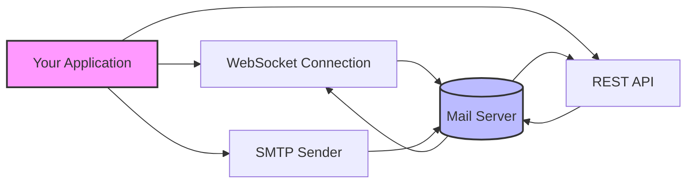

# 📧 Webmails REST API and WebSocket

<div align="center">
  <div style= {width: 100}>
  
  
  *A lightweight TypeScript library for interacting with webmail services through both REST API and WebSocket connections*
  
  [](https://www.typescriptlang.org/)
  [](https://nodejs.org/)
  [](https://opensource.org/licenses/ISC)
  </div>
</div>

## ✨ Features

- 📲 **Dual Connection Methods**: 
  - WebSocket connection for real-time mail monitoring
  - REST API for retrieving inbox content
- 📩 **Email Sending Functionality**: Simple way to send emails through SMTP
- 🔐 **Secure Connections**: TLS support for secure communication
- ⚙️ **Fully Configurable**: Easy to set up with your mail provider
- 📝 **Type Definitions**: Written in TypeScript for better development experience
- 🚀 **Performance Optimized**: Minimal resource usage

## 🔍 Overview



## 📥 Installation

```bash
# Clone the repository
git clone https://github.com/yourusername/webmails-rest-api-and-websocket.git

# Navigate to the project directory
cd webmails-rest-api-and-websocket

# Install dependencies
npm install
```

## ⚙️ Configuration

Create a `.env` file in the root directory with the following variables:

```env
# Webmail IMAP Configuration
user=support@auxaty.com
password=Your email passowrd
host=imap server url
port=port for imap server
tls=tls value mostyly true
rejectUnauthorized= mostly false
NAME=business name

# SMTP Configuration
host_SMTP=smtp.hostinger.com
SMTP_PORT=465
```

## 🛠️ Usage

### Basic Usage

```typescript
import { getInbox } from "./utils/scan-mail-box-rest-api";
import { scanmailbox_WS } from "./utils/scan-mail-box-ws";
import { sendmail } from "./utils/sendMail";

// Define mail processing function
const process_mail = (sender: string, timestamp: Date, body: string) => {
  console.log(`New email from ${sender} at ${timestamp}:`);
  console.log(body);
  // Process your email here
};

// Configure your mailbox
const MAIL_BOX_CONFIG = {
  user: process.env.user as string,
  password: process.env.password as string,
  host: process.env.host as string, // imap.hostinger.com
  port: Number(process.env.port as string), // 993
  tls: Boolean(process.env.tls as string), // true
  tlsOptions: {
    rejectUnauthorized:
      (process.env.rejectUnauthorized as string) == "true" ? true : false, // false
  },
};

// Configure SMTP for sending emails
const TRANSPORT_CONFIG = {
  host: process.env.host_SMTP as string, // smtp.hostinger.com
  port: Number(process.env.SMTP_PORT as string), // 465
  secure: true,
  auth: {
    user: process.env.user as string,
    pass: process.env.password as string,
  },
};

// Start monitoring emails via WebSocket
scanmailbox_WS(MAIL_BOX_CONFIG, process_mail);

// Get existing emails via REST API
await getInbox(MAIL_BOX_CONFIG);

// Send an email
const mailOptions = {
  from: `"${process.env.NAME}" <${process.env.user}>`,
  to: "recipient@example.com",
  subject: "Hello from Auxaty",
  text: "This is a test email sent from my webmail automation.",
};

await sendmail(TRANSPORT_CONFIG, mailOptions);
```

### 🏃‍♂️ Running the Project

```bash
# Compile and run the project
npm run dev
```

## 📚 API Reference

### WebSocket Email Monitoring

```typescript
scanmailbox_WS(mailboxConfig, callbackFunction)
```

- `mailboxConfig`: Configuration object for your mailbox
- `callbackFunction`: Function that processes each incoming email with parameters:
  - `sender`: Email address of the sender
  - `timestamp`: Date object representing when the email was received
  - `body`: Content of the email

### REST API Email Fetching

```typescript
await getInbox(mailboxConfig)
```

- `mailboxConfig`: Configuration object for your mailbox
- Returns all emails in the inbox

### Sending Emails

```typescript
await sendmail(transportConfig, mailOptions)
```

- `transportConfig`: SMTP configuration object
- `mailOptions`: Object containing email details (from, to, subject, text)

## 📊 Architecture

<div align="center">
  
```
┌─────────────────┐       ┌─────────────────┐
│                 │       │                 │
│  Your Node.js   │◄─────►│    Mail Box     │
│  Application    │       │ Configuration   │
│                 │       │                 │
└───────┬─────────┘       └─────────────────┘
        │
        │
┌───────▼─────────┐       ┌─────────────────┐
│                 │       │                 │
│  WebSocket      │◄─────►│  REST API       │
│  Connection     │       │  Connection     │
│                 │       │                 │
└───────┬─────────┘       └────────┬────────┘
        │                          │
        │                          │
┌───────▼──────────────────────────▼────────┐
│                                           │
│              Email Server                 │
│                                           │
└───────────────────────────────────────────┘
```

</div>

## 📱 Compatible Email Providers

This library works with most webmail services.